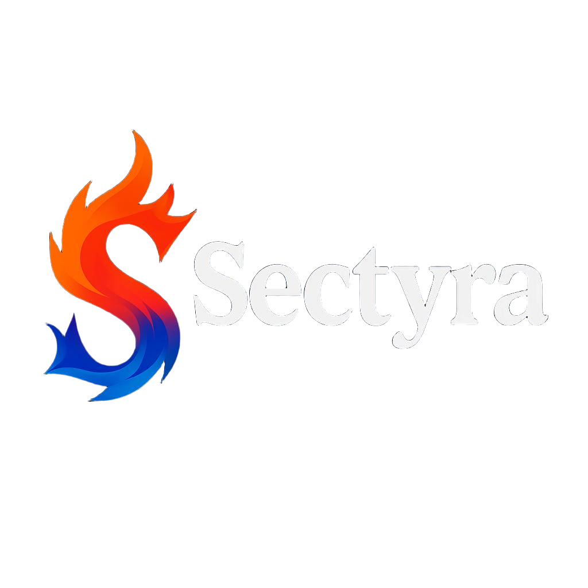
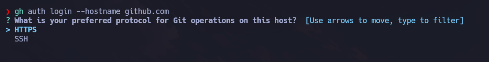
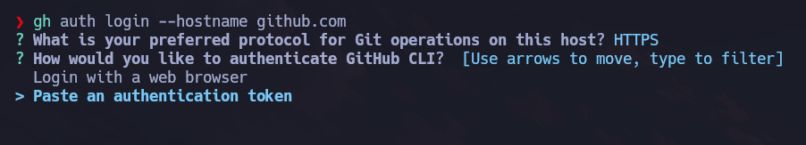
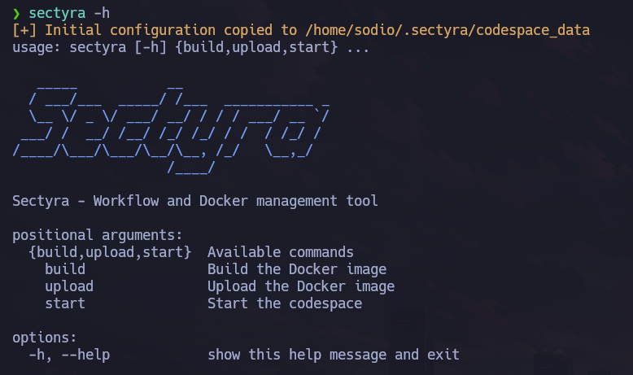
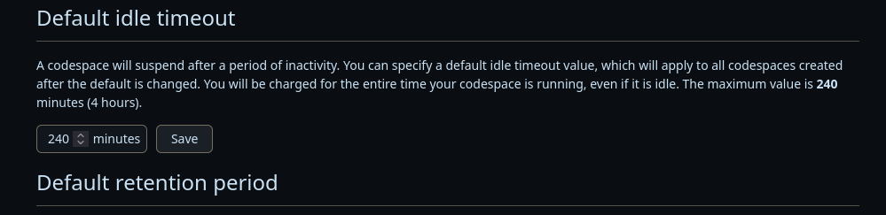
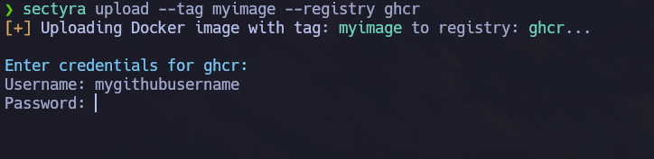

# Sectyra

<p align="center">
  
</p>

**Sectyra** es una herramienta diseñada para automatizar la ejecución de trabajos en entornos efímeros o en simulaciones de estos, como los Codespaces de GitHub. Permite ejecutar múltiples tareas en distintos Codespaces de forma secuencial.

---

***Idioma***
- 🇪🇸 Español
- [🇺🇸 English](https://github.com/hgx64/sectyra)

## Instalar Sectyra

```bash
git clone https://github.com/hgx64/sectyra
cd sectyra
pip3 install .
```

---

## Configuración de GitHub CLI (`gh`)

### Instalación

```bash
sudo apt update && sudo apt install gh git -y
```

### Inicio de sesión

```bash
gh auth login --hostname github.com
```



Selecciona la opción `HTTPS`.



Aquí elige la opción que te parezca mejor. En este caso, seleccionamos usar un **token personal (classic)**.  
Este token debe tener los siguientes permisos:

- `read:org`
- `repo`
- `codespace`

Es importante que uses **el mismo token** más adelante en el archivo `.env` de configuración.

---

## ¿Cómo funciona?

Sectyra gestiona la ejecución de trabajos definidos dentro de un directorio específico del proyecto. Los ejecuta secuencialmente, independientemente de si dependen entre sí o no. Cada trabajo se lanza en un Codespace de GitHub.

Al ejecutarlo por primera vez, Sectyra crea automáticamente el directorio `~/.sectyra`, donde almacenará toda la configuración:

```bash
[+] Initial configuration copied to /home/usuario/.sectyra/codespace_data
```



### Comandos disponibles

```bash
sectyra [-h] {build,upload,start} ...
```

```text
positional arguments:
  {build,upload,start}  Comandos disponibles
    build               Construye la imagen Docker
    upload              Sube la imagen Docker
    start               Inicia los Codespaces
```

---

## Variables de entorno

Las configuraciones se definen en el archivo `~/.sectyra/codespace_data/.env.example`.  
Tras editarlo, cópialo a `.env`:

```bash
cp ~/.sectyra/codespace_data/.env.example ~/.sectyra/codespace_data/.env
```

### Editar `.env`

```ruby
# Cambiar esto
GITHUB_USERNAME=""
DOCKER_IMAGE=""
GIT_TOKEN="ghp_XXXXXXXXXXXXXXXXXXXXXXXX"
GIT_EMAIL="tu_email@github.com"
PATH_RESULTS="/home/codespace/codespace_data/results"
RESULTS_REPO="nombre-repo-resultados"
TERM=xterm
CODE_REPO="github/codespaces-blank"
GITHUB_TOKEN=""
NOTIFY=true
TELEGRAM_API_KEY=""
TELEGRAM_CHAT_ID=""
```

### Detalles clave

- **GITHUB_USERNAME**, **GIT_TOKEN** y **GIT_EMAIL** son obligatorios.
- **GITHUB_TOKEN** debe permanecer vacío (limitación de Codespaces).
- **DOCKER_IMAGE** define la imagen Docker usada por los jobs.
- **CODE_REPO** define qué repositorio se utilizará para los Codespaces.
- **NOTIFY** indica si deseas recibir notificaciones por Telegram.
- **TELEGRAM_API_KEY** y **TELEGRAM_CHAT_ID** son obligatorios si usas notificaciones.
- **RESULTS_REPO** es el repositorio donde se almacenarán los resultados.

---

## Configurar el tiempo de inactividad en Codespaces

Puedes establecer el tiempo de inactividad desde la interfaz web:

- Ve a: [Settings Codespaces](https://github.com/settings/codespaces)
- Establece `Default idle timeout` en **240 minutos** (4 horas).



Sectyra mantiene actividad simulada mediante cron, permitiendo que los jobs duren más tiempo sin ser interrumpidos.

---

## Construcción de la imagen Docker

```bash
sectyra build --tag miimagen --dockerfile-dir /home/myuser/docker
```

### Ejemplo de `Dockerfile`

```Dockerfile
FROM debian:bullseye
ENV DEBIAN_FRONTEND=noninteractive

RUN apt-get update &&     apt-get install -y         curl wget vim git net-tools iputils-ping &&     apt-get clean &&     rm -rf /var/lib/apt/lists/*

RUN useradd -ms /bin/bash test
WORKDIR /home/test
USER test
CMD ["bash"]
```

---

## Subida de imagen Docker

Puedes subirla a `ghcr.io` o `Docker Hub`:

```bash
sectyra upload --tag miimagen --registry ghcr
```



### Para `ghcr.io`

Necesitas:

- Tu usuario de GitHub
- Un token con permiso `write:packages`

Puedes crear el token aquí: https://github.com/settings/tokens

### Para `Docker Hub`

Necesitas:

- Usuario de Docker Hub
- Token de acceso personal con permisos para subir imágenes

Token: https://hub.docker.com/settings/security

Después de subir la imagen, indica su nombre en la variable `DOCKER_IMAGE` en tu archivo `.env`.

---

## Definir jobs

Los jobs están en:

```bash
~/.sectyra/codespace_data/jobs
```

Deben seguir la norma:

- `job.sh.1`
- `job.sh.2`
- `job.sh.3`

Para que sean secuenciales y no tengamos errores al ejecutar.

Ejemplo de un job:

`job.sh.1`
```bash
#!/bin/bash
mkdir -p $PATH_RESULTS/testing.com/ports
docker run -it -v $PATH_RESULTS/testing.com/ports mi-imagen nmap 192.168.1.1/24
```

---

## Iniciar Sectyra

Una vez definidos los jobs, iniciamos el proceso:

```bash
sectyra start
```


---

## Notas importantes

- **Límite Codespaces gratuitos:** 120 horas por core al mes. Es más que suficiente para tareas periódicas.
- **GHCR.io (privado):** Límite de 500 MB por imagen.
- Si un job falla, recibirás notificación (si usas Telegram) y el Codespace será eliminado tras 5 minutos.
- Para ejecutar tareas como root, simplemente añade `sudo` en el script del job.

Ejemplo:

```bash
#!/bin/bash
sudo nmap ...
# more code
```

---

## Recursos adicionales

**Guía para configurar un bot de Telegram:**  
[Instrucciones Telegram BOT](https://docs.radist.online/docs/our-products/radist-web/connections/telegram-bot/instructions-for-creating-and-configuring-a-bot-in-botfather)
