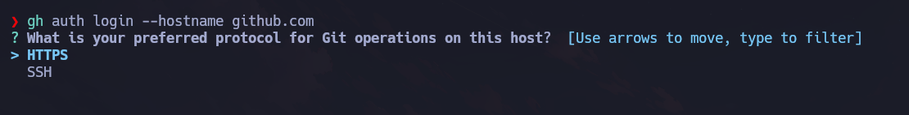
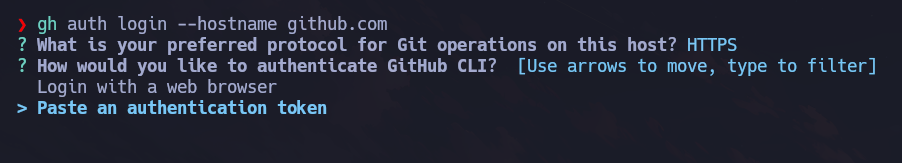
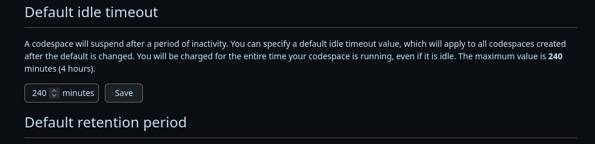

# Sectyra

<p align="center">
  
</p>

**Sectyra** is a tool designed for automating job execution in ephemeral environments or their simulations, such as GitHub Codespaces. It allows you to run multiple tasks across different Codespaces sequentially.

---

***Language***
- [🇪🇸 Español](./README.es.md)
- 🇺🇸 English

## Install Sectyra

```bash
git clone https://github.com/hgx64/sectyra
cd sectyra
pip3 install .
```

---

## Configuring GitHub CLI (`gh`)

### Installation

```bash
sudo apt update && sudo apt install gh git -y
```

### Log in

```bash
gh auth login --hostname github.com
```



Choose the `HTTPS` option.



Select your preferred authentication method. Here, we choose to use a **personal access token**.  
This token must include the following scopes:

- `read:org`
- `repo`
- `codespace`

Make sure this token is the **same one** you later set in your `.env` configuration file.

---

## How It Works

Sectyra orchestrates the execution of jobs defined in a specific folder of your project. It processes them **sequentially**, regardless of their dependencies.  
Each job runs in a GitHub Codespace.

On first launch, Sectyra creates a folder at `~/.sectyra`, storing all configuration data:

```bash
[+] Initial configuration copied to /home/user/.sectyra/codespace_data
```


### Available commands

```bash
sectyra [-h] {build,upload,start} ...
```

```text
positional arguments:
  {build,upload,start}  Available commands
    build               Build the Docker image
    upload              Upload the Docker image
    start               Start the Codespace(s)
```

---

## Environment Variables

All configuration goes into `~/.sectyra/codespace_data/.env.example`.  
Once edited, copy it to `.env`:

```bash
cp ~/.sectyra/codespace_data/.env.example ~/.sectyra/codespace_data/.env
```

### Edit `.env`

```ruby
# Set your values here
GITHUB_USERNAME=""
DOCKER_IMAGE=""
GIT_TOKEN="ghp_XXXXXXXXXXXXXXXXXXXXXXXX"
GIT_EMAIL="yourgithubmail@example.com"
PATH_RESULTS="/home/codespace/codespace_data/results"
RESULTS_REPO="results-repo"
TERM=xterm
CODE_REPO="github/codespaces-blank"
GITHUB_TOKEN=""
NOTIFY=true
TELEGRAM_API_KEY=""
TELEGRAM_CHAT_ID=""
```

### Key Notes

- **GITHUB_USERNAME**, **GIT_TOKEN**, and **GIT_EMAIL** are mandatory.
- **GITHUB_TOKEN** must remain empty (a Codespaces limitation).
- **DOCKER_IMAGE** defines which Docker image to use in the jobs.
- **CODE_REPO** specifies which repo to open in the Codespaces.
- **NOTIFY** enables or disables Telegram notifications.
- **TELEGRAM_API_KEY** and **TELEGRAM_CHAT_ID** are required if using notifications.
- **RESULTS_REPO** will be used to push job outputs from `$PATH_RESULTS` to GitHub.

---

## Codespaces Idle Timeout

To extend idle time in Codespaces:

- Go to: [Settings Codespaces](https://github.com/settings/codespaces)
- Scroll down to `Default idle timeout` and set it to **240 minutes** (4 hours)



Sectyra simulates activity using a cron task to avoid early shutdowns, allowing longer jobs to complete.

---

## Build Docker Image

```bash
sectyra build --tag myimage --dockerfile-dir /path/to/docker
```

### Example `Dockerfile`

```Dockerfile
FROM debian:bullseye
ENV DEBIAN_FRONTEND=noninteractive

RUN apt-get update &&     apt-get install -y         curl wget vim git net-tools iputils-ping &&     apt-get clean &&     rm -rf /var/lib/apt/lists/*

RUN useradd -ms /bin/bash test
WORKDIR /home/test
USER test
CMD ["bash"]
```

---

## Upload Docker Image

To upload to `ghcr.io` or `Docker Hub`:

```bash
sectyra upload --tag myimage --registry ghcr
```


### For `ghcr.io`

You’ll need:

- GitHub username
- A token with `write:packages` scope

Token: https://github.com/settings/tokens

### For Docker Hub

You’ll need:

- Docker Hub username
- Personal access token with image push permissions

Token: https://hub.docker.com/settings/security

After uploading, set `DOCKER_IMAGE` in your `.env` file to the image name.

---

## Define Jobs

Jobs live in:

```bash
~/.sectyra/codespace_data/jobs
```

Job files must follow this naming convention:

- `job.sh.1`
- `job.sh.2`
- `job.sh.3`
- etc.

### Example:

```bash
#!/bin/bash
mkdir -p $PATH_RESULTS/testing.com/ports
docker run -it -v $PATH_RESULTS/testing.com/ports my-image nmap 192.168.1.1/24
```

---

## Start Sectyra

After defining your jobs, start the process:

```bash
sectyra start
```


---

## Important Notes

- **Free GitHub accounts** are limited to 120 hours of Codespace usage per core/month.
- **GHCR.io (private)**: 500 MB image size limit — enough if well-compressed.
- If a job fails, you’ll get a Telegram alert (if notifications are enabled), and the Codespace will be deleted after 5 minutes.
- To run something as root, just prefix with `sudo` inside the job file.

Example:

```bash
#!/bin/bash
sudo nmap ...
```

---

## Telegram Notifications

To receive notifications via Telegram, set up a bot using the official instructions:  
[Telegram BOT setup guide](https://docs.radist.online/docs/our-products/radist-web/connections/telegram-bot/instructions-for-creating-and-configuring-a-bot-in-botfather)
